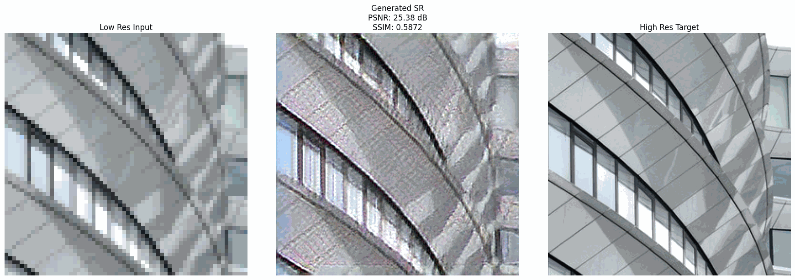

# 🚀 SCAttNet: Spatial and Channel Attention Network for Super-Resolution
Resolution**  🔍✨  
*Author: Anthony (Zhejiang University)*

## 📥 **Download the Notebook & Trained Model**

Ready to dive into cutting-edge super-resolution? I’ve made it easy for you to get started! Below, you’ll find the Jupyter Notebook and the trained model, both available for download. The notebook walks you through the entire process, and the model is ready to boost your super-resolution tasks. Download, experiment, and unlock the power of super-resolution!

### 📖 Jupyter Notebook:
[Access the notebook](https://drive.google.com/file/d/1uwmyMCoXayzm6EgTMbt-U-ujJks3fPYe/view?usp=sharing)

### 💻 Trained Model:
[Download the trained model (`model.pth`)](https://drive.google.com/drive/folders/1n_CiytoVxQnah6B-xmSN1F1FFRvWYsFV?usp=drive_link)

---

## 🔧 **Model Architecture Overview**


---

## 🌟 **What Makes This Model Stand Out?**

- **🧠 Spatial and Channel Attention Network for Super-
Resolution**  
  Unlock the power of **Channel**, **Spatial**, and **Self-Attention** to extract intricate features and preserve fine details—elevating your super-resolution capabilities to new heights!

- **⚡ Progressive Upsampling for Ultra-Clear Images**  
  Achieve **4× super-resolution** through a high-quality upsampling pipeline, designed for those who demand clarity and precision in every pixel.

- **🎯 Train on a Variety of Datasets**  
  This model is ready to tackle datasets like **DIV2K**, **Urban100**, **Manga109**, and more. You can train, evaluate, and experiment—no need to worry about dataset compatibility!

- **📊 Advanced Performance Metrics**  
  Track your model's progress with key performance metrics like **PSNR**, **SSIM**, and **perceptual loss (VGG)**—ensuring you get optimal results for every image.

- **🚦 One-Command Training Pipeline**  
  Forget about complex setups. With just **one command**, you can launch the training process and see your model improve in real-time.

---

## 🌍 **Ready to Experiment?**

Whether you're a researcher, developer, or enthusiast, this model is built for anyone eager to push the boundaries of super-resolution. Dive into the code, modify it to suit your needs, and let your creativity run wild!

---

Explore, experiment, and enhance the super-resolution capabilities for your own tasks. If you run into any questions, don't hesitate to reach out. 🚀


## 🛠️ **Quick Start**

### 1. **Installation**

Set up your environment and install the necessary dependencies:

```bash
conda create -n trisr python=3.9 -y
conda activate trisr
pip install -r requirements.txt
```
### 2. **Download Datasets (Auto-downloader included!)**
Get all the datasets for training and testing in one go:

```bash
python download_data.py
```
### 3. **Train the Model**
Ready to train? Simply execute:
```bash
python main.py
```
### 4. **Test on Your Own Images**
Want to upscale your own images? Here’s how you can do it:
```bash
from model import SuperResolutionNet

# Load pretrained model
model = SuperResolutionNet().load_from_checkpoint("model.pth")

# Upscale your image
enhanced_image = model.upscale("your_image.jpg")
```
**🚀 Unlock the Power of Image Super-Resolution!**  
Transform low-resolution images into stunning high-resolution masterpieces with our state-of-the-art PyTorch model, powered by a revolutionary triple attention mechanism. Watch as every detail comes to life, and experience clarity like never before! ✨

👀 **See the Magic in Action!**  
Here’s a sneak peek at how our model enhances images—witness the incredible transformation as blurry, low-res images turn into crisp, high-res versions:

  
  
  
  
  

*(The examples above are just a glimpse! Replace these placeholders with your own mind-blowing results.)*

---

## 🏗️  **Architecture Overview**
Innovative Components:
| Component                        | Description                                                                                      |
|-----------------------------------|--------------------------------------------------------------------------------------------------|
| 🔄 Residual Attention Blocks      | Integrating residual learning with attention mechanisms for robust feature mapping.              |
| 🎛️ Channel-Spatial Attention Fusion | A powerful fusion of channel and spatial attention to adaptively enhance features.               |
| 🏗️ Learned Skip Connections       | Skip connections that are optimized during training to ensure more effective learning.           |
| ⚖️ GAN-Based Training             | Leverage the power of Generative Adversarial Networks for more realistic and sharper results.     |


## 📈  **Performance**

Here’s how TriAttSR stacks up across different datasets:


| Dataset         | Bicubic          | SRCNN           | MemNet          | EDSR            | RDN             | RCAN            | RRDB ESRGAN     |SCAttNet|
|-----------------|------------------|-----------------|-----------------|-----------------|-----------------|-----------------|-----------------|-------------------------------------------|
| **Set14**       | 26.00/0.7027     | 27.50/0.7513    | 28.26/0.7723    | 28.80/0.7876    | 28.81/0.7871    | 28.87/0.7889    | 28.88/0.7896     | **29.18/0.7712** |
| **BSD100**      | 25.96/0.6675     | 26.90/0.7101    | 27.40/0.7281    | 27.71/0.7420    | 27.72/0.7419    | 27.77/0.7436    | 27.76/0.7432    | **28.71/0.7015** |
| **Urban100**    | 23.14/0.6577     | 24.52/0.7221    | 25.50/0.7630    | 26.64/0.8033    | 26.61/0.8028    | 26.82/0.8087    | 26.73/0.8072    | **27.99/0.7209** |
| **Manga109**    | 24.89/0.7866     | 27.58/0.8555    | 29.42/0.8942    | 31.02/0.9148    | 31.00/0.9151    | 31.22/0.9173    | 31.16/0.9164    | **27.33/0.7765** |


## 🎯 **Use Cases**
TriAttSR can be used in various real-world applications:

| Application               | Example Use                                                        |
|---------------------------|--------------------------------------------------------------------|
| 📱 Mobile Photo Enhancement | Improve the quality of photos on your smartphone.                  |
| 🎬 Video Remastering       | Enhance old or low-quality video frames to HD.                     |
| 🏥 Medical Imaging         | Improve the clarity of medical images for better diagnosis.        |
| 🛰️ Satellite Imagery       | Improve satellite images for better precision in mapping.          |
| 🎨 Digital Art Restoration | Enhance and restore artwork with improved details.                 |


## 🧑‍💻 **Development**
Folder Structure
Here’s the folder structure for TriAttSR:

```bash
TriAttSR/
├── models/          # Core network architectures
├── datasets/        # Data loading utilities
├── configs/         # Training configurations
├── utils/           # Helper functions
├── results/         # Output images and metrics
└── experiments/     # Training logs and checkpoints
```


## 📜 **License**
This project is licensed under the MIT License – free for academic and commercial use!

✨ Try It Yourself!
Sample inference code to upscale your own images:

```bash
import torch
import cv2
from model import SuperResolutionNet

model = SuperResolutionNet()
model.load_state_dict(torch.load("model/model.pth")['generator_state_dict'])
model.eval()

lr_image = cv2.imread("low_res.jpg")
lr_tensor = torch.tensor(lr_image).float().div(255).unsqueeze(0).permute(0, 3, 1, 2)

with torch.no_grad():
    sr_image = model(lr_tensor).squeeze().permute(1, 2, 0).cpu().numpy()

cv2.imwrite("high_res.jpg", cv2.cvtColor((sr_image * 255).astype("uint8"), cv2.COLOR_RGB2BGR))
print("Generated high-res image saved as 'high_res.jpg'")

```


