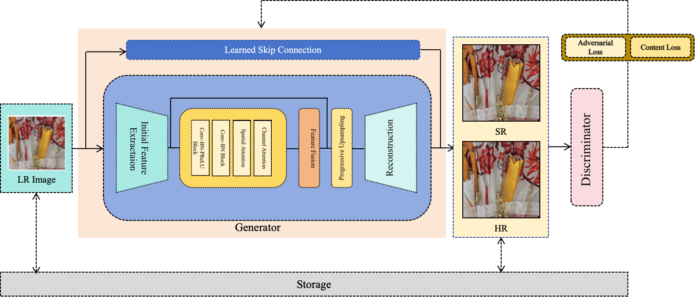
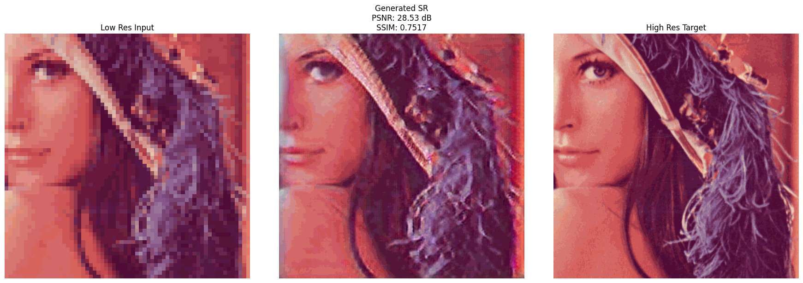
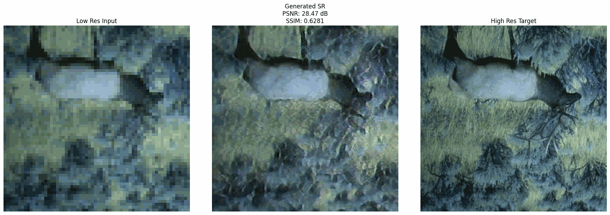
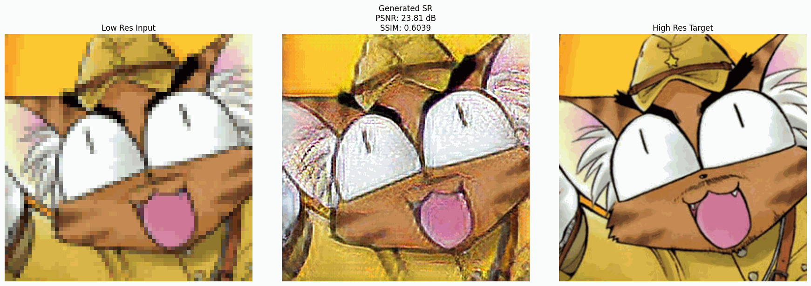

# 🚀 Triple Attention Super-Resolution  🔍✨
Author : Anthony (Zhejiang University)
### **Model Architecture Image**


## 🌟 **Key Features**

- **🧠 Triple Attention Mechanism**  
  Harnessing the power of Channel, Spatial, and Self-Attention for enhanced feature extraction and detail preservation.
  
- **⚡ Progressive Upsampling**  
  Achieve 4× super-resolution with a high-quality upsampling pipeline.
  
- **🎯 Multi-Dataset Support**  
  Train and evaluate on diverse datasets like DIV2K, Urban100, Manga109, and more.

- **📊 Enhanced Evaluation Metrics**  
  Performance measured with PSNR, SSIM, and perceptual loss (VGG).

- **🚦 Easy Training Pipeline**  
  Ready-to-go training with a one-command execution. Just run and go!

---

## 🛠️ **Quick Start**

### 1. **Installation**

Set up your environment and install the necessary dependencies:

```bash
conda create -n trisr python=3.9 -y
conda activate trisr
pip install -r requirements.txt
```
### 2. **Download Datasets (Auto-downloader included!)**
Get all the datasets for training and testing in one go:

```bash
python download_data.py
```
### 3. **Train the Model**
Ready to train? Simply execute:
```bash
python main.py
```
### 4. **Test on Your Own Images**
Want to upscale your own images? Here’s how you can do it:
```bash
from model import SuperResolutionNet

# Load pretrained model
model = SuperResolutionNet().load_from_checkpoint("model.pth")

# Upscale your image
enhanced_image = model.upscale("your_image.jpg")
```
**🚀 Unlock the Power of Image Super-Resolution!**  
Transform low-resolution images into stunning high-resolution masterpieces with our state-of-the-art PyTorch model, powered by a revolutionary triple attention mechanism. Watch as every detail comes to life, and experience clarity like never before! ✨

👀 **See the Magic in Action!**  
Here’s a sneak peek at how our model enhances images—witness the incredible transformation as blurry, low-res images turn into crisp, high-res versions:

  
  
  
  
  

*(The examples above are just a glimpse! Replace these placeholders with your own mind-blowing results.)*

---

## 🏗️  **Architecture Overview**
Innovative Components:
| Component                        | Description                                                                                      |
|-----------------------------------|--------------------------------------------------------------------------------------------------|
| 🔄 Residual Attention Blocks      | Integrating residual learning with attention mechanisms for robust feature mapping.              |
| 🎛️ Channel-Spatial Attention Fusion | A powerful fusion of channel and spatial attention to adaptively enhance features.               |
| 🏗️ Learned Skip Connections       | Skip connections that are optimized during training to ensure more effective learning.           |
| ⚖️ GAN-Based Training             | Leverage the power of Generative Adversarial Networks for more realistic and sharper results.     |


## 📈  **Performance**

Here’s how TriAttSR stacks up across different datasets:


| Dataset         | Bicubic          | SRCNN           | MemNet          | EDSR            | RDN             | RCAN            | RRDB ESRGAN     | Super-Resolution Model (Triple Attention) |
|-----------------|------------------|-----------------|-----------------|-----------------|-----------------|-----------------|-----------------|-------------------------------------------|
| **Set14**       | 26.00/0.7027     | 27.50/0.7513    | 28.26/0.7723    | 28.80/0.7876    | 28.81/0.7871    | 28.87/0.7889    | 28.88/0.7896     | **29.18/0.7712** |
| **BSD100**      | 25.96/0.6675     | 26.90/0.7101    | 27.40/0.7281    | 27.71/0.7420    | 27.72/0.7419    | 27.77/0.7436    | 27.76/0.7432    | **28.71/0.7015** |
| **Urban100**    | 23.14/0.6577     | 24.52/0.7221    | 25.50/0.7630    | 26.64/0.8033    | 26.61/0.8028    | 26.82/0.8087    | 26.73/0.8072    | **27.99/0.7209** |
| **Manga109**    | 24.89/0.7866     | 27.58/0.8555    | 29.42/0.8942    | 31.02/0.9148    | 31.00/0.9151    | 31.22/0.9173    | 31.16/0.9164    | **27.33/0.7765** |


## 🎯 **Use Cases**
TriAttSR can be used in various real-world applications:

| Application               | Example Use                                                        |
|---------------------------|--------------------------------------------------------------------|
| 📱 Mobile Photo Enhancement | Improve the quality of photos on your smartphone.                  |
| 🎬 Video Remastering       | Enhance old or low-quality video frames to HD.                     |
| 🏥 Medical Imaging         | Improve the clarity of medical images for better diagnosis.        |
| 🛰️ Satellite Imagery       | Improve satellite images for better precision in mapping.          |
| 🎨 Digital Art Restoration | Enhance and restore artwork with improved details.                 |


## 🧑‍💻 **Development**
Folder Structure
Here’s the folder structure for TriAttSR:

```bash
TriAttSR/
├── models/          # Core network architectures
├── datasets/        # Data loading utilities
├── configs/         # Training configurations
├── utils/           # Helper functions
├── results/         # Output images and metrics
└── experiments/     # Training logs and checkpoints
```


## 📜 **License**
This project is licensed under the MIT License – free for academic and commercial use!

✨ Try It Yourself!
Sample inference code to upscale your own images:

```bash
import torch
import cv2
from model import SuperResolutionNet

model = SuperResolutionNet()
model.load_state_dict(torch.load("model/model.pth")['generator_state_dict'])
model.eval()

lr_image = cv2.imread("low_res.jpg")
lr_tensor = torch.tensor(lr_image).float().div(255).unsqueeze(0).permute(0, 3, 1, 2)

with torch.no_grad():
    sr_image = model(lr_tensor).squeeze().permute(1, 2, 0).cpu().numpy()

cv2.imwrite("high_res.jpg", cv2.cvtColor((sr_image * 255).astype("uint8"), cv2.COLOR_RGB2BGR))
print("Generated high-res image saved as 'high_res.jpg'")

```


